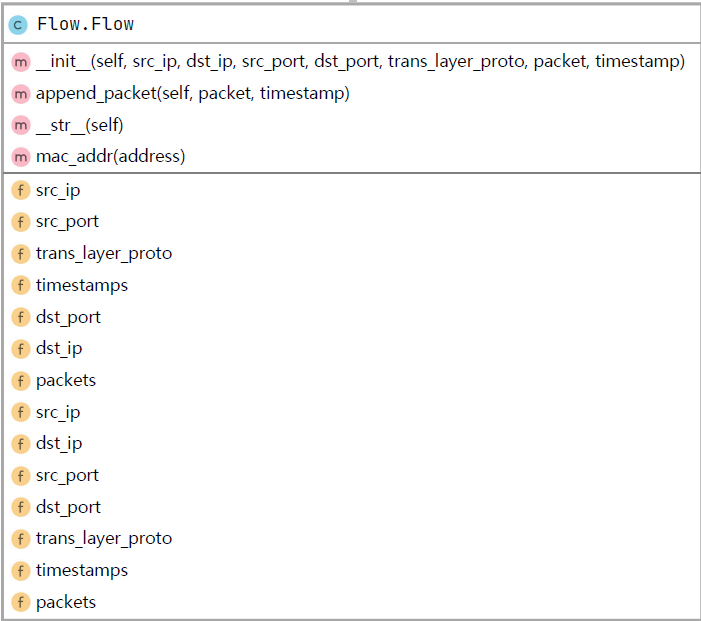

# [组流实验](https://github.com/Malfurionzz/network_measurement)

### 实验背景

​		Flow是网络测量中一个比较基础的概念，在 文献【1】中，flow被定义为“一对端点（endpoint）之间双向传输的数据包的集合”，这里的端点可以是主机也可以是网络。

​		在互联网领域，flow有时是指<协议类型、源IP地址、目的IP地址、源端口号、目的端口号>的五元组相同的数据包的集合，但更精确的讲，这样的集合应被称为microflow。为了方便，在本文中，我们将microflow称为流。

​		常见的组流方法有以下几种：

1. 基于Wireshark提供的tshark API，编写Lua脚本进行组流。Lua是一种轻量小巧的脚本语言，对于效率要求较高的模块，通常以C语言实现，并通过Lua进行调用。该方法的优点是Wireshark支持的协议众多，可达到2000+，同时对于报文内容解码详细，tshark底层使用的是C语言编写，解码效率较高。
2. 在python中调用编写的Lua脚本，通过对于tshark的封装，在python中调用lua脚本功能。
3. 使用python中的dpkt模块(本实验中使用此方法)。支持的解析协议有常见的IP、TCP、UDP、SSL等。对于每一个协议都有一个单独的类负责该层协议进行解析，输入是该协议的二进制数据，输出的是将二进制解析成有意义的单独字段。

### 实验内容

1. 使用某种方法实现组流功能。
2. 统计分析流特征：（1）流的总数 (2)流长度 (3)正确输出流五元组信息和源mac地址、目的mac地址。
3. 连续读取多个PCAP数据包。(可以采用批量读取或其他方法)

### 使用文档及运行样例

#### 项目结构

本项目的结构如下：

```
lab1/
├── bi_log								#存放双向流的组流结果
│   ├── ipv6.pcap.log
│   ├── test0.pcap.log
│   └── test1.pcap.log
├── edconfig.ini						#存放批量组流的pcap文件列表
├── Flow_Aggregation_test.py			
├── Flow.py								
├── pcap								#存放所有pcap包
│   ├── ipv6.pcap
│   ├── test0.pcap
│   └── test1.pcap
├── README.md							
└── uni_log								#存放单向流的组流结果
    ├── ipv6.pcap.log
    ├── test0.pcap.log
    └── test1.pcap.log
```

#### 使用方法

##### 依赖安装

​		本项目开发环境为`python3.8`,下面以Windows平台为例（Linux对应使用`python3` 和`pip3`）

首先需安装`dpkt`依赖包。

```shell
pip install dpkt
```

​	或

```shell
conda install dpkt
```

###### pcap包指定

​		首先先将所需pcap包放入`lab1/pcap`目录下，接着修改`lab1/edconfig.ini`文件，在其中加入指定pcap包。

```ini
[source]
#需要做检测的pcap文件名称
pcapName0=ipv6.pcap
pcapName1=test1.pcap
pcapName2=test0.pcap
```

##### 命令行参数

在项目根目录下可进行以下操作：

```bash
python Flow_Aggregation_test.py -h		# 软件使用说明
python Flow_Aggregation_test.py -u		# 单向流
python Flow_Aggregation_test.py -b		# 双向流
```

​	所得结果如下（以`bi_log/test0.pcap`和`uni_log/ipv6.pcap`为例：

```bash
# bi_log/test0.pcap.log

Number of flows: 3
Flow:
src_mac: fc:db:b3:e9:37:96
dst_mac: 22:53:49:24:ae:9a
src_ip:192.168.137.227
dst_ip: 31.13.82.36
src_port: 36291
dst_port: 443
packet_number:1652
flow length: 1482652

Flow:
src_mac: fc:db:b3:e9:37:96
dst_mac: 22:53:49:24:ae:9a
src_ip:192.168.137.227
dst_ip: 31.13.68.16
src_port: 36388
dst_port: 443
packet_number:155
flow length: 107054

Flow:
src_mac: 22:53:49:24:ae:9a
dst_mac: fc:db:b3:e9:37:96
src_ip:31.13.68.16
dst_ip: 192.168.137.227
src_port: 443
dst_port: 43030
packet_number:1229
flow length: 1046489
```

```bash
# uni_log/ipv6.pcap **仅展示前三个流**
Number of flows: 83
Flow:
src_mac: 00:00:5e:00:01:01
dst_mac: 74:70:fd:c4:8a:c9
src_ip:2606:2800:147:120f:30c:1ba0:fc6:265a
dst_ip: 2001:da8:1002:a001::6:fb1c
src_port: 443
dst_port: 14900
packet_number:11
flow length: 13151

Flow:
src_mac: 74:70:fd:c4:8a:c9
dst_mac: 00:00:5e:00:01:01
src_ip:2001:da8:1002:a001::6:fb1c
dst_ip: 2606:2800:147:120f:30c:1ba0:fc6:265a
src_port: 14900
dst_port: 443
packet_number:11
flow length: 886

Flow:
src_mac: 00:00:5e:00:01:01
dst_mac: 74:70:fd:c4:8a:c9
src_ip:120.204.17.124
dst_ip: 10.208.67.228
src_port: 8000
dst_port: 4006
packet_number:9
flow length: 1121
```

可以看到，本软件能够对单向流和双向流进行组流操作，并且同时能够支持IPv4和IPv6的数据报。

### UML图与主要数据结构

​		使用Flow类对流进行描述。

​		其中，实例域中`flow.packets`和`flow.timestamps`均为python内置的`list`，分别对于记录了时间顺序的每个数据包和时间戳。

另外，为了打印mac地址，在课程提供的实例域模板的基础上增加了对mac地址的记录。

​		魔术方法`__str__`：提供了对象的格式化输出，本函数考虑了IPv4和IPv6的差异性。

​		静态方法`mac_addr`：提供了mac地址的格式化输出。



### 主要算法说明

#### 报文解析

​		dpkt提供了各层协议的解析方法，通过逐层分离，可以得到每一个报文的五元组的各个元素。

​		本实验采取了较为简单的方法对同一流进行判定，即：逐个比较每个数据包中的五元组各个元素是否相同。根据需求不同，能够支持单向流和双向流的组流。

```python
def flow_combine(ip_pkt_list, ip_tms_list, flow_definition):
    """
    组流
    :param ip_pkt_list:
    :param ip_tms_list:
    :param flow_definition:
    :return:
    """
    flow_list = []
    src_port = None
    dst_port = None
    trans_layer_proto = None
    for (pkt_stream, tms) in zip(ip_pkt_list, ip_tms_list):
        eth = dpkt.ethernet.Ethernet(pkt_stream)
        pkt = eth.data
        src_ip = pkt.src
        dst_ip = pkt.dst
        if pkt.p == dpkt.ip.IP_PROTO_TCP:  # TCP数据包
            tcp_packet = pkt.tcp
            src_port = tcp_packet.sport
            dst_port = tcp_packet.dport
            trans_layer_proto = dpkt.ip.IP_PROTO_TCP
        elif pkt.p == dpkt.ip.IP_PROTO_UDP:  # UDP数据包
            udp_packet = pkt.udp
            src_port = udp_packet.sport
            dst_port = udp_packet.dport
            trans_layer_proto = dpkt.ip.IP_PROTO_UDP
        if len(flow_list) == 0:  # 初次
            flow = Flow(src_ip, dst_ip, src_port, dst_port, trans_layer_proto, eth, tms)
            flow_list.append(flow)
        else:
            flow_is_exist = False
            if flow_definition == 1:  # 单向流
                for flow_unit in flow_list:
                    """
                    判断是否同流
                    """
                    if flow_unit.src_ip == src_ip and flow_unit.dst_ip == dst_ip and flow_unit.src_port == src_port and flow_unit.dst_port == dst_port:
                        flow_is_exist = True
                        flow_unit.append_packet(eth, tms)
                        break
            elif flow_definition == 2:  # 双向流
                for flow_unit in flow_list:
                    if ((
                                flow_unit.src_ip == src_ip and flow_unit.dst_ip == dst_ip and flow_unit.src_port == src_port and flow_unit.dst_port == dst_port) or (
                                flow_unit.src_ip == dst_ip and flow_unit.dst_ip == src_ip and flow_unit.src_port == dst_port and flow_unit.dst_port == src_port)) and flow_unit.trans_layer_proto == trans_layer_proto:
                        flow_is_exist = True
                        flow_unit.append_packet(eth, tms)
                        break
            if not flow_is_exist:
                """
                插入新流
                """
                flow = Flow(src_ip, dst_ip, src_port, dst_port, trans_layer_proto, eth, tms)
                flow.append_packet(eth, tms)
                flow_list.append(flow)
    return flow_list
```

### 进一步的工作

​		本实验采取了较为简单的方法对同一流进行判定。但实际上，对于大规模的流量集合，简单匹配的方法往往不满足网络测量的性能需求，常常使用哈希值【2】进行性能优化。常用的哈希算法有：

1. 异或位移哈希算法
2. IPSX哈希算法
3. CRC32哈希算法

### 总结

​		总过本实验，我们加深了对网络测量中的flow的理解，了解了组流的基本方法，感受到了组流在网络测量中的重要性，初步理解dpkt的工作机制和使用方法。同时也练习了python语言的使用。

		### 参考文献

1. Brownlee, N., & Claffy, K. C. (2002). Understanding Internet traffic streams: Dragonflies and tortoises. *Communications Magazine*, *40*(10), 110–117. [IEEE Xplore Abstract](https://ieeexplore.ieee.org/document/1039865/)

2. 程光,龚俭,丁伟, 等.面向IP流测量的哈希算法研究[J].软件学报,2005,16(5):652-658.